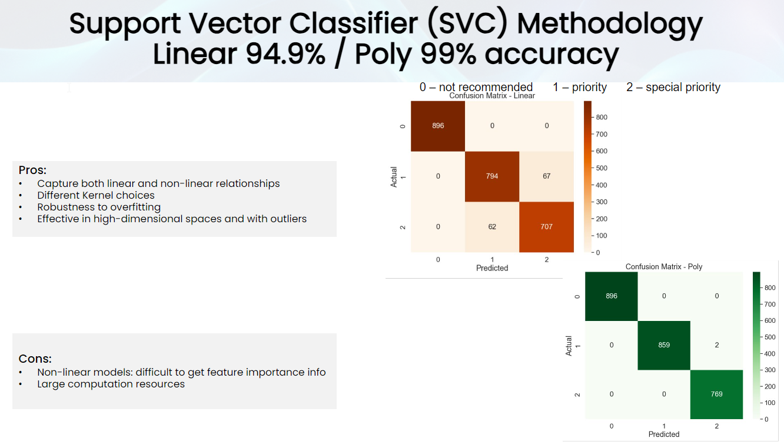

 

# Nursery Schools Enrollment. An approximation through a ML lense.

  
## Table of Contents

- [Summary](#summary)
- [Installation](#installation)
- [Example](#example)
- [Results and conlusion of analysis](#results)
- [License](#license)

## Summary

We studied a case of excessive enrollment in nursery schools in Ljubljana, Slovenia.  A ML algorithm was used to address the **excessive enrollment** issue providing a framework for evaluating and ranking applications​. *Various machine learning methodologies offer distinct advantages and trade-offs in predicting nursery school admissions* based on factors such as parents' occupation and family structure. The implications of each are significant.​

## Installation and Access to Study

Please access our study via this link: https://johan-preus/ml-project-2/

## Example

Below is an one of our findings using the Support Vector Classifier (SVC) Methodology​.

 

## Results

Each methodology offers unique advantages and challenges in analyzing the nursery dataset.  By understanding the strengths and limitations of each methodology, we can choose the most appropriate approach to analyze the nursery dataset and gain valuable insights into factors influencing nursery school admissions or any other subject.

**An important conclusion, especially for us as students, is realizing how choosing the right methodology can have an impact on real-life scenarios and affect people in the offline life.** 

## License

By including the MIT License in our project, we are granting others the freedom to use, modify, and distribute your code, with minimal restrictions. 

MIT License

Copyright (c) [2024] [The Python Weatherpeople]

Permission is hereby granted, free of charge, to any person obtaining a copy
of this software and associated documentation files (the "Software"), to deal
in the Software without restriction, including without limitation the rights
to use, copy, modify, merge, publish, distribute, sublicense, and/or sell
copies of the Software, and to permit persons to whom the Software is
furnished to do so, subject to the following conditions:

The above copyright notice and this permission notice shall be included in all
copies or substantial portions of the Software.

THE SOFTWARE IS PROVIDED "AS IS", WITHOUT WARRANTY OF ANY KIND, EXPRESS OR
IMPLIED, INCLUDING BUT NOT LIMITED TO THE WARRANTIES OF MERCHANTABILITY,
FITNESS FOR A PARTICULAR PURPOSE AND NONINFRINGEMENT. IN NO EVENT SHALL THE
AUTHORS OR COPYRIGHT HOLDERS BE LIABLE FOR ANY CLAIM, DAMAGES OR OTHER
LIABILITY, WHETHER IN AN ACTION OF CONTRACT, TORT OR OTHERWISE, ARISING FROM,
OUT OF OR IN CONNECTION WITH THE SOFTWARE OR THE USE OR OTHER DEALINGS IN THE
SOFTWARE.

